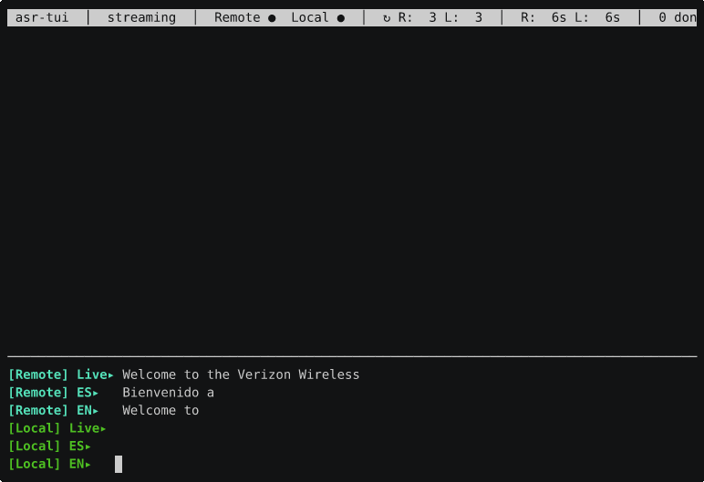
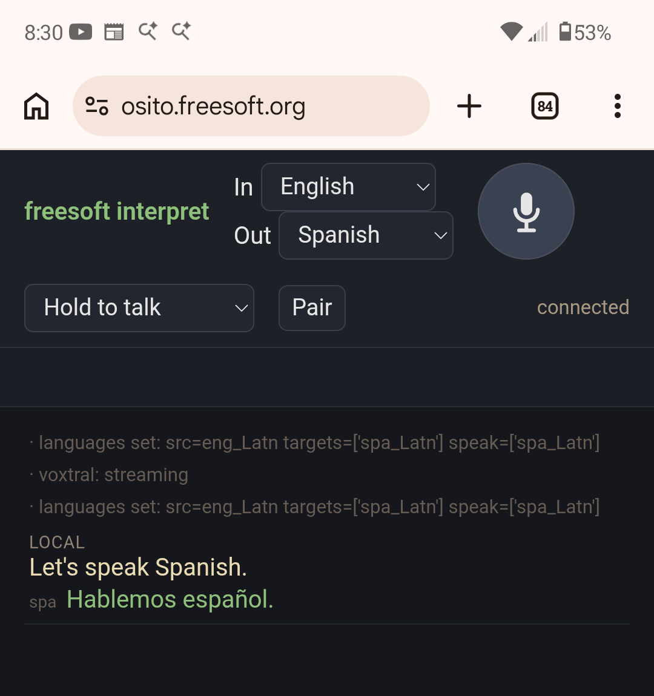

# freesoft-asr — live streaming speech recognition with inline translation

A terminal UI (`freesoft-asr`) that transcribes audio in real time using
**Voxtral-Mini-4B-Realtime** (served by vLLM, GPU) and, optionally,
translates each completed sentence into one or more configured target
languages with **NLLB-200-distilled-600M** (CTranslate2 int8, CPU). It
is **config-file driven**: sources, endpoint, model, and per-stream
languages all come from a TOML file (and/or CLI flags), so it works for
anything from "transcribe whatever's playing on this machine" to
multi-channel multilingual phone-call transcription.

Its intended use is **live translation of a telephone call**: the phone
is Bluetooth-tethered to the laptop, so the call audio flows into the
laptop and each side of the conversation is transcribed and translated as
it is spoken (the built-in `dual` profile is exactly this — the near and
far ends as two streams). The other party hears nothing from the tool; it
is a listener's aid on your end of the call.



*Above: a live call to an automated bilingual hotline. `[Remote]` (cyan)
is the far end, `[Local]` (green) is the near end; each shows the raw
Voxtral transcription plus inline Spanish and English translation.*

Each stream renders a **Live** row (raw Voxtral output, any language,
possibly code-switched) plus **one row per configured target language**
(NLLB translation, masked-tail live preview):

```
[Remote] Live ▸  raw Voxtral output (any language; possibly code-switched)
         ES   ▸  NLLB Spanish translation (masked-tail live preview)
         EN   ▸  NLLB English translation (masked-tail live preview)
```

A stream with **no** target languages is transcription-only and renders
just the Live row. With **no config and no flags**, that is the default:
a single stream capturing the default sink monitor, transcription only —
NLLB is not even loaded.

Finalized sentences interleave into a scrolling speaker-tagged history
below. Sentence-level *marker-MT* (NLLB receives the whole accumulated
Spanish with `[1] [2] [3]` markers between visual chunks) keeps the
per-chunk translations coherent and aligned, rather than fragmented
into context-free pieces.

- **Config-file driven** — a TOML file (default
  `~/.config/freesoft-asr/config.toml`) sets the endpoint, model,
  sources, and per-stream languages. CLI flags override the file;
  `freesoft-asr --write-config` emits a fully-commented starter config.
- **Generic, per-stream sources** — each source picks an audio target
  (`-` stdin, `monitor` default-sink monitor, or a PipeWire node name),
  a label/colour, an optional `src_lang`, and a list of target languages.
- **Per-stream multilingual translation** — translate one stream into
  any number of languages; the live region and history grow one row per
  target. Default = transcription-only (no NLLB load) until you ask for
  targets.
- **Per-sentence source-language auto-detection** (fastText lid.176) —
  each completed sentence's language is detected once and fed to NLLB,
  so code-switched calls translate correctly. Pin `src_lang` to disable.
- **Live region per stream** (Live + one row per target); interleaved
  speaker-tagged history.
- **Whole-sentence marker-MT** — chunks become visible as they're
  spoken (`⋯` placeholder), then backfill with proper chunk-aligned
  translation once the sentence completes, avoiding the garbled output
  you get from translating three-word fragments in isolation.
- **Multi-stream concurrent transcription** — independent vLLM sessions
  per source, separately auto-recycled. The built-in **`dual`** profile
  (`--profile dual`) expands to the author's two RTP phone-call sources
  (Remote + Local, each Spanish→{Spanish,English}).
- **Named profiles** — `[profiles.<name>]` config tables are full
  config overlays (scalars + their own `[[profiles.<name>.source]]`
  streams), selected with `--profile NAME`. `--list-profiles` lists
  them; a `default_profile` key auto-selects one.
- **Scrollback** — mouse wheel + ↑/↓/PgUp/PgDn/Home/End on the
  history pane. Live region keeps updating regardless.
- **Ctrl-L** clears the history and recycles the WS sessions (frees
  the vLLM KV cache for both streams immediately).
- **Ctrl-W** writes the entire running transcript to
  `DDMonYYYY-HHMM.txt` in the current directory (a same-minute repeat
  gets a `-2`/`-3` suffix) and drops a dim "transcript written …"
  marker into the history at that point.
- **VAD-driven auto session recycle** (silero-vad) — each stream's
  WS closes/reopens during natural silences, bounding its session
  length to speaker-continuous-talk-time rather than the call's
  duration. Avoids the vLLM `--max-model-len` ceiling that otherwise
  crashes the EngineCore around 22 minutes of continuous audio per
  session.
- **`--plain`** headless mode for logging and validation.

## Web interface (`web/`)

Alongside the terminal UI there is a **browser interpreter**,
`freesoft-interpret-web`, that drives the same pipeline
(Voxtral ASR + NLLB MT + Pocket-TTS/Piper/MeloTTS) over WebRTC, deployed
in production on pony at `https://osito.freesoft.org/`.

Where the terminal UI listens in on a phone call, this is intended for a
**conversation in which both parties use the web app** — each on their
own phone or laptop. In paired mode the two clients cross-translate: each
person speaks and reads in their own language, and hears the other's
speech translated and spoken aloud.

- **Solo & paired modes** — solo: pick *In*/*Out* languages, speak, and
  hear the translation; paired: two clients cross-translate, each hearing
  the other in its own language, joined by a one-tap **Pair** toggle.
- **LOCAL / REMOTE transcript** — in paired mode every utterance is
  labelled and colour-coded by origin (you vs. the peer).
- **Four microphone modes** — hold-to-talk, tap-to-talk/stop, locked-on,
  and disconnected (fully releases the mic for other apps); the mic also
  auto-releases when the page is backgrounded.
- **13 languages, switchable live** — language dropdowns re-target the
  session mid-call without dropping the Voxtral stream.
- **Speak-back TTS** — translations are synthesized and played to the
  listener (Pocket-TTS / Piper / MeloTTS, chosen per language).
- **Everything over port 443** — WebRTC media + signaling are muxed with
  a TURN relay behind haproxy, so it works from restrictive networks.

<p align="center">
  
</p>

*Above: the web interface on Android — a `solo` English→Spanish session
showing the microphone-mode selector, the **Pair** button, and a
**LOCAL** utterance with its Spanish translation spoken back.*

See **[`web/README.md`](web/README.md)** for architecture, the systemd
services, and the haproxy/coturn 443-mux deployment. A printable
one-page sign announcing the service in all 13 languages lives at
**[`web/translation-service-sign.pdf`](web/translation-service-sign.pdf)**
(regenerate with `python3 web/sign/build.py`).

## Pipeline

```
audio (S16LE 16 kHz mono)
   → Voxtral-Mini-4B-Realtime-2602    (vLLM /v1/realtime WS, GPU)   ─┐
                                                                      │ raw text deltas
   ← cur_live (raw, possibly code-switched) ← ← ← ← ← ← ← ← ← ← ← ← ←┘
   → fastText lid.176 once per sentence → detected source language
                                          (skipped if src_lang pinned)
   → NLLB-200-distilled-600M int8     (CTranslate2, CPU, batched)
                                       target_prefix=[[tgt1],[tgt2],…]
   → live preview: cur_tr[tgt] (masked tail), one per target
   → marker-MT at sentence boundaries → chunk-aligned per-target backfill
                                       into the scrolling history pane
```

(The fastText + NLLB stages run only for streams that have target
languages; a transcription-only stream stops after the Voxtral row.)

The cascade (rather than direct speech-to-text-translation) is
deliberate: it keeps NLLB entirely on CPU so all the GPU goes to
Voxtral, and the raw `Live` text stays visible alongside the cleaned
ES/EN.

## Configuration

`freesoft-asr` reads a TOML file at
`$XDG_CONFIG_HOME/freesoft-asr/config.toml` (default
`~/.config/freesoft-asr/config.toml`). Precedence is **built-in defaults
< config file < selected profile overlay < CLI flags**. Generate a
fully-commented starter file:

```bash
freesoft-asr --write-config          # writes to the standard path
freesoft-asr --write-config --config ./my.toml
```

Every key mirrors a CLI flag (snake_case). Example config expressing the
author's phone-call setup (the same as the built-in `dual` profile) plus
a third target on one stream:

```toml
host  = "127.0.0.1"
port  = 8000
model = "mistralai/Voxtral-Mini-4B-Realtime-2602"
nllb_dir = "~/asr/models/nllb-600m-ct2"

# Fallback source language used only if fastText is unavailable AND no
# src_lang is pinned. Otherwise the source language is auto-detected
# per sentence.
default_src_lang = "eng_Latn"

[[source]]
target    = "rtp_call_remote_source"
label     = "Remote"
accent    = "1;36"                  # cyan
tgt_langs = ["spa_Latn", "eng_Latn"]

[[source]]
target    = "rtp_call_me_source"
label     = "Local"
accent    = "1;32"                  # green
tgt_langs = ["spa_Latn", "eng_Latn", "fra_Latn"]
```

A `[[source]]` inherits the global `src_lang` / `tgt_langs` unless it
overrides them. An empty `tgt_langs` makes a stream transcription-only.

### Profiles

A `[profiles.<name>]` table is a **full named config overlay**. It may
set any top-level key (host, port, model, beam, mask, languages, pause
timings, auto-recycle, …) **and** define its own streams via
`[[profiles.<name>.source]]`. Select one with `--profile NAME`:

```toml
default_profile = "dual"            # auto-select when no --profile given

# Replaces the built-in "dual" profile (config wins over the built-in):
[[profiles.dual.source]]
target    = "rtp_call_remote_source"
label     = "Remote"
accent    = "1;36"
tgt_langs = ["spa_Latn", "eng_Latn"]

[[profiles.dual.source]]
target    = "rtp_call_me_source"
label     = "Local"
accent    = "1;32"
tgt_langs = ["spa_Latn", "eng_Latn"]

# A scalar-only profile inherits the top-level [[source]] streams:
[profiles.tv]
beam      = 4
tgt_langs = ["eng_Latn"]
```

Resolution rules:

- **Scalars**: a key present in the selected profile overrides the
  top-level value (which overrides the built-in default).
- **Sources**: if the profile defines sources they **replace** the
  top-level sources; if it defines none, the top-level sources are
  inherited (so a scalar-only profile still has streams).
- **CLI wins**: `--source`, `--beam`, etc. on the command line override
  the selected profile. `--profile` overrides `default_profile`.

A built-in **`dual`** profile ships in the code, so `--profile dual`
reproduces the author's two-stream phone-call setup with no config at
all. A config `[profiles.dual]` of the same name fully replaces it.
List the available profiles (built-in + config) with:

```bash
freesoft-asr --list-profiles
```

An unknown `--profile NAME` errors and lists the available names.

## Running

### Default — transcribe whatever's playing (transcription only)

```bash
freesoft-asr
```

With no config and no flags this captures the **default sink's monitor**
(via `pw-record -P stream.capture.sink=true`) and shows just the Live
row — no translation, NLLB not loaded.

### Single-stream from stdin (any audio source)

```bash
your_audio_source | freesoft-asr --source -
```

The audio must be **S16LE mono at 16 kHz**. With PipeWire:

```bash
pw-record --target <your-source> --format=s16 --rate=16000 \
          --channels=1 - | freesoft-asr --source -
```

With ALSA / arecord:

```bash
arecord -f S16_LE -r 16000 -c 1 -D <your-device> | freesoft-asr --source -
```

From a file:

```bash
sox input.wav -t raw -r 16000 -c 1 -b 16 -e signed-integer - | freesoft-asr --source -
```

Add translation with `--tgt-lang` (repeatable):

```bash
your_audio_source | freesoft-asr --source - --tgt-lang eng_Latn --tgt-lang fra_Latn
```

### Multi-stream and the built-in `dual` profile

Repeat `--source TARGET[=LABEL]` for several streams:

```bash
freesoft-asr --source 'rtp_call_remote_source=Remote' \
             --source 'rtp_call_me_source=Local' \
             --tgt-lang spa_Latn --tgt-lang eng_Latn
```

The built-in **`dual`** profile is exactly the author's phone-call setup —
the PipeWire sources **`rtp_call_remote_source`** (Remote, cyan) and
**`rtp_call_me_source`** (Local, green), each translating into Spanish +
English:

```bash
freesoft-asr --profile dual
```

Either configure PipeWire to expose your sources under those names (see
below), or use `--source` / a `[[source]]` config / your own
`[profiles.<name>]` with your own names.

### Headless / `--plain`

```bash
freesoft-asr [--profile dual] --plain
```

Skips the alt-screen TUI and prints `[spk] Live` + one row per target
language on stdout per finalized chunk. Useful for piping into a logger.

### CLI knobs

Run `freesoft-asr --help` for the full list with current defaults.
Highlights:

- `--config PATH` / `--write-config` — point at / generate a config file.
- `--source TARGET[=LABEL]` — add an audio source (repeatable).
- `--tgt-lang CODE` / `--src-lang CODE` / `--no-translate` — global
  language controls (per-stream control lives in the config).
- `--host` / `--port` / `--model` / `--nllb-dir` — endpoint + models.
- `--pause-ms` / `--sentence-close-ms` — two-tier pause behaviour
  (short pause flushes a visual chunk; long pause closes the sentence
  and triggers marker-MT).
- `--mask` — words to hide off the live preview tail (model tail
  tokens are unstable until more context arrives).
- `--beam` — NLLB beam-search width (1 = greedy, default).
- `--auto-recycle-silence-ms` / `--auto-recycle-min-s` /
  `--auto-recycle-backstop-s` — when the WS auto-recycle fires.
- `--no-line-flush` — disable the last-resort `clause_flush` width
  break entirely.

## Requirements

- **vLLM serving Voxtral-Mini-4B-Realtime** on
  `127.0.0.1:8000/v1/realtime` (host/port set via config or
  `--host`/`--port`).
- An **NLLB-200-distilled-600M int8 CTranslate2** model at
  `~/asr/models/nllb-600m-ct2/` (or `--nllb-dir`) — **only needed if you
  translate**. Transcription-only runs don't load it.
- **fastText lid.176** (`fasttext-wheel` or `fasttext-langdetect`) for
  per-sentence source-language detection — only needed if you translate
  *and* don't pin `src_lang`. Degrades to `default_src_lang` with a
  warning if missing.
- A **CUDA GPU** with ≥ 16 GB VRAM (Voxtral weights + KV cache at
  `--max-model-len 16384`).
- **PipeWire** (Linux) for the `monitor` / named-source / `dual`-profile
  audio capture; the `--source -` stdin path works with any audio source
  (PipeWire, ALSA, sox, ffmpeg, etc.).

End-to-end setup — venvs, model conversion, the optional vLLM systemd
unit, and recreating the alternative venvs for the reference scripts
— is in **[INSTALL.md](INSTALL.md)**.

## PipeWire setup for the dual-stream RTP path

[PipeWire](https://pipewire.org/) is the audio (and video) server that
underpins most current Linux desktops, and its real strength is routing.
Everything — every application stream, microphone, speaker, Bluetooth
device — is a node in a graph, and you can connect, split, and re-route
those nodes arbitrarily, live, while audio is flowing. If you know JACK,
the low-latency pro-audio server, PipeWire will feel like a natural
successor: it adopted JACK's graph model (and speaks its protocol), then
folded PulseAudio's everyday mixing and device handling in on top — to my
mind, essentially **JACK v3** that also happens to be your ordinary
desktop sound system.

The useful consequence here is that a node in that graph need not be
local hardware. PipeWire ships RTP send/receive modules, so any source
or sink — the monitor of your laptop's speakers, your microphone — can
be streamed straight out over the network as UDP. That is exactly how
`freesoft-asr` gets fed in the phone-call setup: the phone is
Bluetooth-paired to a PipeWire laptop that taps its own audio and dumps
it across the LAN to a server (where the GPU
lives) running the transcriber, so the machine doing the *listening*
can be nowhere near the machine doing the *transcribing*.

The dual-stream design assumes the two audio channels arrive as
**RTP streams** from a sender host — e.g. a desktop with a phone
paired over Bluetooth that taps the analog sink monitor (remote-party
voice) and the analog mic capture (local voice), shipping each as a
UDP RTP stream to the receiver running `freesoft-asr`. This makes the
transcribing machine independent of where the audio source actually
lives (and lets you run the GPU on a separate, more powerful host).

### On the receiver (the machine running `freesoft-asr --profile dual`)

Drop this into
`~/.config/pipewire/pipewire.conf.d/91-rtp-call-stream-source.conf`:

```pipewire
context.modules = [
    {   name = libpipewire-module-rtp-source
        args = {
            source.ip         = "0.0.0.0"
            source.port       = 46000
            sess.latency.msec = 300
            stream.props = {
                node.name        = "rtp_call_remote_source"
                node.description = "RTP <- remote party"
                media.class      = "Audio/Source"
                audio.format     = "S16LE"
                audio.rate       = 48000
                audio.channels   = 2
                audio.position   = [ FL FR ]
            }
        }
    }

    {   name = libpipewire-module-rtp-source
        args = {
            source.ip         = "0.0.0.0"
            source.port       = 46002
            sess.latency.msec = 300
            stream.props = {
                node.name        = "rtp_call_me_source"
                node.description = "RTP <- local mic"
                media.class      = "Audio/Source"
                audio.format     = "S16LE"
                audio.rate       = 48000
                audio.channels   = 2
                audio.position   = [ FL FR ]
            }
        }
    }
]
```

Then restart PipeWire (`systemctl --user restart pipewire wireplumber
pipewire-pulse`) or log out and back in. Verify with `pw-cli ls Node |
grep rtp_call_` — both sources should appear. `freesoft-asr --profile
dual` will then find them by name and start streaming.

`pw-record`'s own resampler converts 48 kHz stereo down to 16 kHz
mono on the consumer side, so the RTP wire format stays at the
loopback's native 48 kHz stereo.

### On the sender (the machine producing the audio)

The sender combines `libpipewire-module-rtp-sink` (the UDP egress)
with `libpipewire-module-loopback` (routing specific PipeWire devices
into each sink). Sketch — for a setup with a Bluetooth-paired phone
playing audio through the sender's analog sink:

```pipewire
context.modules = [
    # ---- Remote party: capture the analog sink's monitor ----
    {   name = libpipewire-module-rtp-sink
        args = {
            destination.ip   = "<receiver-IP>"
            destination.port = 46000
            stream.props = {
                node.name      = "rtp_call_remote_sink"
                media.class    = "Audio/Sink"
                audio.format   = "S16LE"
                audio.rate     = 48000
                audio.channels = 2
                audio.position = [ FL FR ]
            }
        }
    }
    {   name = libpipewire-module-loopback
        args = {
            capture.props = {
                stream.capture.sink = true
                target.object       = "<your-analog-sink-node-name>"
                audio.rate          = 48000
                audio.channels      = 2
            }
            playback.props = {
                target.object = "rtp_call_remote_sink"
                audio.rate    = 48000
                audio.channels = 2
            }
        }
    }

    # ---- Local mic: capture the mic device ----
    {   name = libpipewire-module-rtp-sink
        args = {
            destination.ip   = "<receiver-IP>"
            destination.port = 46002
            stream.props = { node.name = "rtp_call_me_sink"; ... }
        }
    }
    {   name = libpipewire-module-loopback
        args = {
            capture.props  = {
                target.object = "<your-analog-mic-node-name>"
                audio.rate = 48000; audio.channels = 2
            }
            playback.props = {
                target.object = "rtp_call_me_sink"
                audio.rate = 48000; audio.channels = 2
            }
        }
    }
]
```

Two gotchas learned the hard way:

- **Loopback identity rule.** `module-loopback` must use the **same**
  `audio.rate` and `audio.channels` on both `capture.props` and
  `playback.props`. Any mismatch silently triggers an
  auto-resample/downmix path that attenuates the signal by ~25 dB —
  the loopback shows as `[active]` in `wpctl status` but the audio
  on the playback side is 15× too quiet. Keep loopbacks as identity
  passthrough; do rate/channel conversion at the consumer.
- **`.monitor` suffix gotcha.** `target.object =
  "<sink-name>.monitor"` does **not** match a real node in PipeWire
  1.0.5 — the session manager treats it as "target not found" and
  falls back to the default source (usually the mic). To tap a
  sink's monitor, set `stream.capture.sink = true` on `capture.props`
  instead.

The RTP overlay is *fire-and-forget UDP*. If the receiver is down,
the sender's audio path is unaffected and the packets are discarded.
When the receiver comes back up, transcription resumes without any
sender-side action.

## Same-host / local-audio variants

If your audio is already on the same machine as Voxtral (no RTP
needed), you have four options:

- **Default monitor** — just run `freesoft-asr` (no args) to transcribe
  the default sink's monitor.
- **A named PipeWire source** — `freesoft-asr --source <node-name>` (or
  `--source <node-name>=Label`), optionally with `--tgt-lang`.
- **stdin** — `pw-record --target <src> --format=s16 --rate=16000
  --channels=1 - | freesoft-asr --source -`.
- **Multi-stream with local sources** — repeat `--source` for each, or
  list them as `[[source]]` tables in the config.

## Alternative streaming scripts (in this repo for reference)

The repo also contains several standalone `stream-*.py` scripts that
explore different ASR engines and latency/quality trade-offs. They
were evaluated during the design of `freesoft-asr`; Voxtral was chosen
for the final TUI. Each is self-contained — reads raw 16-bit-LE mono
16 kHz PCM on stdin and prints transcripts on stdout.

| Script | Model / engine | Notes |
|---|---|---|
| `stream-voxtral.py` | Voxtral-Realtime (vLLM WS) | headless ES stream (the ASR half of the cascade) |
| `stream-voxtral-translate.py` | Voxtral + NLLB | headless live ES + inline EN (pre-TUI form) |
| `stream-vosk.py` | Vosk/Kaldi | true-streaming Spanish, ≈Whisper accuracy on clean audio |
| `stream-sherpa-ipa.py` | sherpa-onnx zipformer | streaming ES in IPA phonemes (no word boundaries) |
| `stream-parakeet-live.py` | parakeet-tdt-0.6b-v3 | immediate-emit, low latency |
| `stream-parakeet.py` | parakeet-tdt-0.6b-v3 + Silero VAD | VAD-chunked + `--max-sec` force-flush for pauseless speech |
| `stream-parakeet-buffered.py` | parakeet-tdt (offline) | LocalAgreement-2 sliding window |
| `stream-whisper.py` | faster-whisper-large-v3 | 99-language auto-detect |
| `stream-whisper-buffered.py` | faster-whisper | LocalAgreement-2, language-pinned |
| `stream-canary.py` | canary-1b-flash (NeMo) | single-pass ASR + translation |
| `stream-cacheaware.py` | NeMo fastconformer | true cache-aware English streaming |

`asr-call-transcribe` is a faster-whisper dual-stream transcriber using
the same `rtp_call_remote_source` / `rtp_call_me_source` audio-input
architecture, but with whisper in place of Voxtral + NLLB — an
alternative reference implementation of the two-source plumbing.

Setup commands for recreating any of these venvs and downloading the
models they need are in **[INSTALL.md](INSTALL.md#recreating-the-alternative-venvs-and-models)**.

## License

MIT — see [LICENSE](LICENSE).

---

*This repository is developed with the assistance of an AI agent
(Claude, via Claude Code) on behalf of Brent Baccala
(cosine@freesoft.org). Per-commit authorship and co-authorship
trailers record the provenance.*
